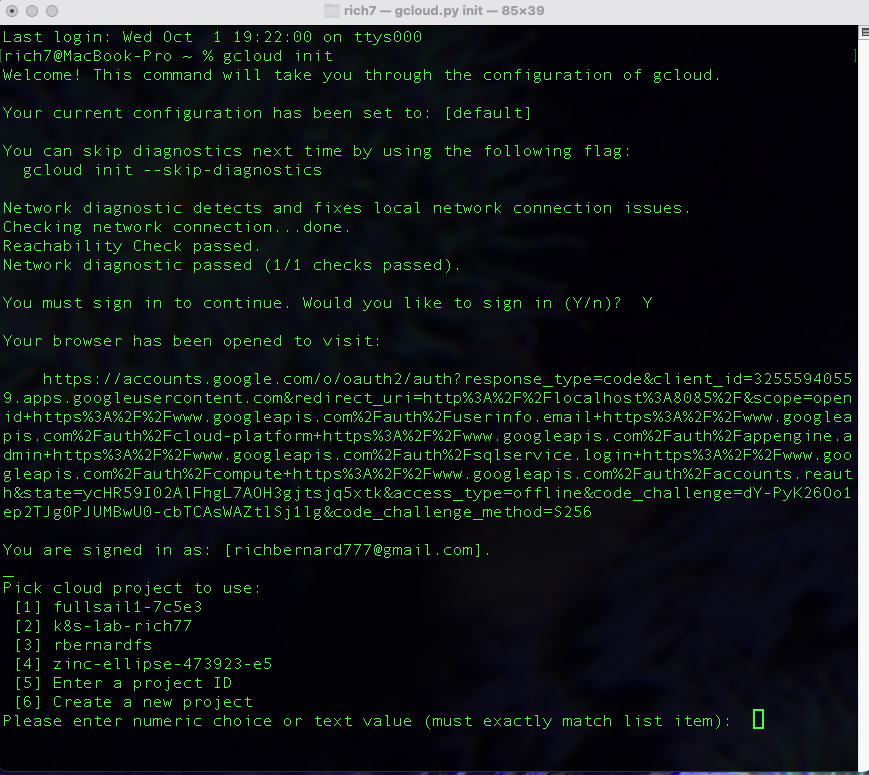
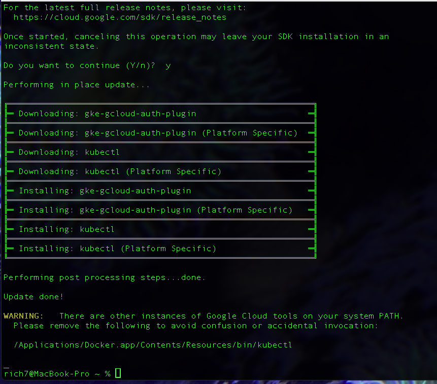
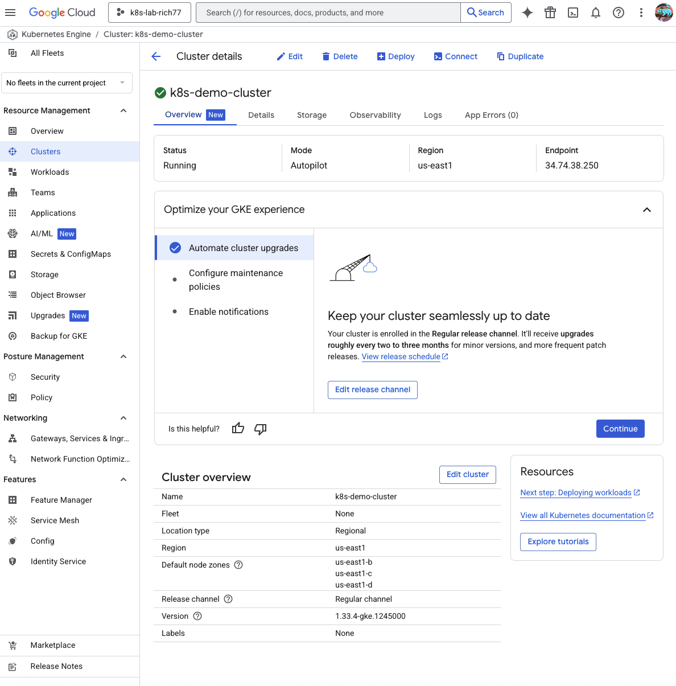
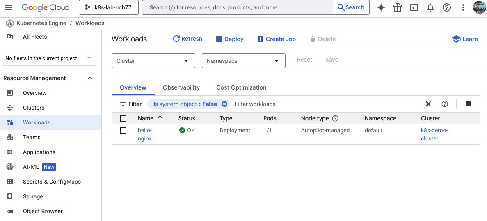
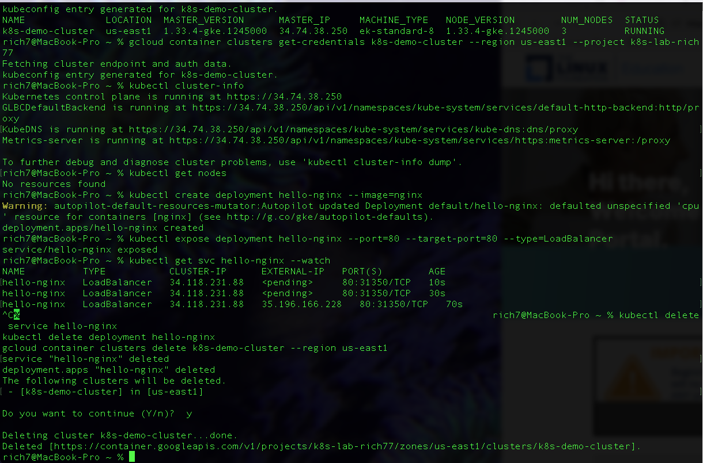

# Kubernetes on Google Cloud – Hands-On Walkthrough

This project demonstrates deploying a simple nginx web server on Google Kubernetes Engine (GKE) in Autopilot mode. It documents every command run, explains what each command does, and includes screenshots of both the Google Cloud Console (GUI) and the CLI as proof of work.  

## Steps

1. Authenticate and Setup Project
```bash
gcloud init

Initializes the Google Cloud CLI, signs you into your account, and sets a default project/region for commands.



2. Enable Kubernetes Engine API
gcloud services enable container.googleapis.com


Enables the Kubernetes Engine API so you can create and manage clusters.


3. Install kubectl
gcloud components install kubectl

Installs kubectl, the Kubernetes CLI used to manage clusters and workloads.




4. Create a Kubernetes Cluster
gcloud container clusters create-auto k8s-demo-cluster --region us-east1


Creates a fully managed Kubernetes cluster named k8s-demo-cluster in Autopilot mode.
Autopilot means Google provisions and manages worker nodes for you.




5. Connect kubectl to the Cluster
gcloud container clusters get-credentials k8s-demo-cluster --region us-east1 --project k8s-lab-rich77
kubectl cluster-info


Updates your local kubeconfig so kubectl can talk to the new cluster.
The second command confirms your connection to the Kubernetes control plane.


6. Deploy Nginx
kubectl create deployment hello-nginx --image=nginx


Creates a Deployment named hello-nginx that runs the official nginx container image.
Kubernetes ensures that at least one replica of this pod is always running.


7. Expose Nginx with a LoadBalancer
kubectl expose deployment hello-nginx --port=80 --target-port=80 --type=LoadBalancer
kubectl get svc hello-nginx --watch


Creates a Service of type LoadBalancer, which provisions a Google Cloud Load Balancer.
This assigns an External IP so you can access nginx in a browser.


When the external IP appears, open it in a browser to see the nginx welcome page.




8. Cleanup (Save Trial Credits)
kubectl delete service hello-nginx
kubectl delete deployment hello-nginx
gcloud container clusters delete k8s-demo-cluster --region us-east1

Deletes the service and deployment, then removes the cluster to avoid ongoing costs.




What This Demonstrates

Creating and managing a Kubernetes cluster in GCP.

Deploying a containerized application (nginx).

Exposing it to the internet with a LoadBalancer.

Cleaning up resources to control costs.

This project serves as a portfolio-ready demonstration of deploying workloads on Kubernetes in Google Cloud.

**Repo Structure**

k8s-gcp-nginx-demo/
│
├── README.md
│
screenshots/
  01-cluster-overview.png
  02-api-enabled.png
  03-workload-hello-nginx.png
  04-service-loadbalancer.png
  05-nginx-browser.png
  CLI/
    01-gcloud-init.png
    02-install-kubectl.png
    03-get-credentials.png
    04-cleanup.png


